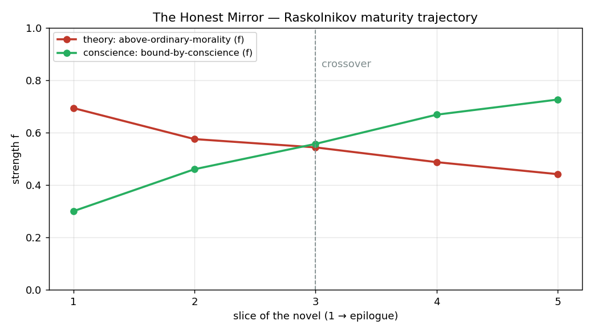

# Crime and Discernment

*The Honest Mirror: a coaching core that reasons over ephemeral atoms and renders no verdict — only a checkable hypothesis. Proven on Raskolnikov.*

**BGI Sprint 1 · Track 1 (extends OmegaClaw) · 26–28 June 2026 · MIT**

---

## Abstract

When an agent judges a person, the danger is not that it guesses wrong — modern LLMs read developmental signals fluently. The danger is **confidence laundering**: a fluent verdict that arrives unauditable, inconsistent between runs, and prematurely certain, with no trail and no memory. We ask whether the discernment can instead sit in a symbolic non-axiomatic layer over an *ephemeral* substrate — OmegaClaw's AtomSpace lives for a single inference call — and still hold the thread of who a person is. We answer **yes**, with three compensations: revision accumulates confidence on a durable term, a side-map carries provenance across calls, and a vector store holds memory. The same architecture yields what a bare LLM cannot — a checkable receipt, and an abduction ceiling that keeps every reading a hypothesis, never a verdict. We prove the honesty-and-verifiability claim on a public-domain character with a ground-truth contradiction — Raskolnikov — and demonstrate that the engine tracks not just a single judgment but a **trajectory of maturation** across the novel. We close by sketching the generalisation: one invariant reasoner, many swappable lenses.

---

## 1 · The problem: confidence laundering

Ask a stateless model for a person's core contradiction and you get a sentence — fluent, plausible, and different on every run. It cannot show you *why* it concluded what it did, it does not remember what it decided last time, and it collapses a live tension into a single confident claim. None of this reads as a hallucination, which is exactly what makes it dangerous: the judgment *looks* trustworthy while being unauditable, unstable, and over-certain. In coaching, reflection, and developmental work — where the subject is a human being and the cost of a wrong, unchallengeable verdict is highest — this is disqualifying. We name it **confidence laundering**: the laundering of an ungrounded guess into the appearance of a justified judgment.

The rest of this note is one answer to one question: can the discernment be moved out of the fluent layer and into a symbolic one that *cannot* launder confidence — and still be useful?

---

## 2 · Porfiry's Mirror — the engine

Porfiry Petrovich never arrests Raskolnikov. He has no confession, no witness, no proof that would survive a courtroom. What he has is a method: he sets the stated theory beside the enacted life and waits, holding the contradiction steady in front of the man until the man arrives at himself. He surfaces; he never sentences. That posture — *hold the hypothesis, force the collision, render no verdict* — is the whole design. We build it as **Porfiry-as-a-Service**.

**One guess, then arithmetic.** Exactly one step uses the LLM: extraction. A reflection becomes NAL atoms of the form `((--> subject predicate) (stv f c))` — a typed claim carrying a *frequency* and a *confidence*. Because extraction is the noisy link (LLMs swap subjects and overstate certainty), input confidence is capped at 0.5. Everything downstream is symbolic and reproducible: the discernment runs as `|-` on OmegaClaw's PeTTa engine (MeTTa over SWI-Prolog), and the same atoms yield the same judgment every time. The LLM proposes; it does not get to conclude.

**Revision makes a contradiction visible — it doesn't assert one.** A person's claim about themselves (`STATED`) and the evidence of their action-narratives (`ENACTED`) land on the *same* NAL term. NAL revision then accumulates: agreeing evidence raises confidence, conflicting evidence drives frequency toward 0.5 *while confidence keeps rising*. That signature — `f → ~0.5, c ↑` — is a `CONTESTED` term: a contradiction that became *mathematically* legible, not a sentence the model decided to write. The tension is found, with a number, or it isn't there.

**Self-opacity is made expensive, on purpose.** A narrative is compartmentalised: the inaugural speech is sincerely collaborative, the meeting notes are sincerely "I decided alone, there was no time" — each compartment honest *within itself*, the contradiction living only *between* them and invisible from inside (the same blindness an LLM, itself compartmentalised, smooths over). So we don't wait for it to be noticed. A scheduled pass — `AuditTask` → `ContextBridge` → `CollisionToken` (ADMIT / QUARANTINE / REJECT) — forces stated and enacted compartments to meet under cross-context revision. This is the Porfiry move rendered in atoms: arrange the facts so they collide.

**The abduction ceiling is the refusal to sentence.** Once a behaviour contests a stated value, abduction reaches for the hidden cause that reconciles both — the *competing commitment* beneath the surface. NAL abduction is structurally capped at `c ≈ 0.45`, below the threshold to ACT. So an abduced reading is *permanently a hypothesis*, gated to `HYPOTHESIZE`, surfaced as a question — never a verdict. This is not prompt discipline that a jailbreak can peel off; it is arithmetic. The engine *cannot* over-claim about a person, by construction.

**Holding the thread over an ephemeral substrate.** OmegaClaw's AtomSpace is born fresh for each `|-` call and dies with it — knowledge does not survive even the neighbouring call. We hold the thread anyway, with three compensations: **revision** accumulates confidence on a durable term across observations; a **side-map** carries provenance (which episode, STATED or ENACTED) across calls, since the bare NAL term must match for revision to fire and so cannot carry the source itself; and a **vector store** (ChromaDB) holds the long memory. The symbolic layer is transient by design — which forces every judgment to lean on durable provenance rather than on whatever happened to be lingering in the graph.

**The receipt.** Every surfaced tension ships with its trail:

```
premises    → which atoms supported and contested it (with provenance tags)
rule        → revision · collision · abduction
truth-value → f, c at each step
gate        → ACT / HYPOTHESIZE / IGNORE
```

A human — or another agent — can check it premise by premise, and refute it; refutation re-enters as a new premise and revises the model (`GROUND`). This is the exact inverse of confidence laundering from §1: where the bare LLM hands you a fluent, unstable, trail-less verdict, Porfiry's Mirror hands you a stable hypothesis you can audit and overturn. The judgment is honest not because the model is well-behaved, but because the architecture will not let it be otherwise.

<!-- OPTIONAL verified Goertzel pull-quote (ethics-in-substrate / self-opacity expensive / paraconsistency) + source — drop in before final push if time allows -->

---

## 3 · Six patterns, one engine

The engine is not a contradiction detector. Contradiction is the *first* pattern, not the only one. What the engine actually does is more general: it issues a **weighted, provenance-bearing, capped judgment about a pattern in human data** — and a contradiction is one shape that pattern can take. Change the *question* (and the lens configuration), not the engine, and the same pipeline — `EXTRACT → SEED → REVISE → COLLIDE → ABDUCE → GATE → SURFACE → GROUND` — finds a different thing.

| Pole | Pattern | What it means for the person | This sprint |
|---|---|---|---|
| Shadow | **contradiction** (STATED ↔ ENACTED) | where word parts ways with deed | ✅ wired |
| Shadow | blind spot / reasoning distortion | where the logic stalls, unseen | designed |
| Light | **undisclosed potential** (ENACTED > STATED) | where the deed *exceeds* the self-image | designed |
| Light | coherence | where the person is whole — also worth naming | designed |
| Time | **trajectory / growth** | how a pattern moves across slices | ✅ wired *(headline, §5)* |
| Time | maturation / readiness | approach to the next stage | designed |

The **reverse pole** is the conceptually important one. Abduction normally reaches for the hidden cause of a *conflict*; turn it 180° and it reaches for a hidden *resource*: a capacity the person enacts repeatedly (episodes a, b, c) but never claims in their own self-description. Same ceiling (`c ≈ 0.45`), same delivery as a question — "you keep doing Y; is that a strength you have not claimed, or chance?" This is **strengths-spotting with provenance**, not flattery — and it is held to the *same* honesty ceiling, because the light pole has the same over-claim trap as the shadow (an uncapped compliment is just pleasant confidence laundering).

For this sprint we wire **two** patterns end-to-end — contradiction and trajectory — and document the other four as design. The claim under test is about the *engine*, not the catalogue: one invariant reasoner, swappable targets.

---

## 4 · Lenses (swappable)

A **lens** is a swappable module over the invariant engine. The engine — NAL, truth-value, revision, the abduction ceiling, the receipt, grounding, insight pacing — never changes. The lens sets three things only: the **atom vocabulary** (what to extract), what counts as a **TENSION**, and the **output form**.

| Lens | What it extracts | What counts as TENSION |
|---|---|---|
| **Action Logic** (Cook-Greuter / Torbert) | stage-of-meaning indicators | gap between current stage and the stage a challenge demands |
| **Immunity to Change** (Kegan) | stated goal + counter-behaviour | the competing commitment beneath |
| **Four Dimensions** (quadrants) | claims sorted by inner/outer × individual/collective | energy spent where the problem isn't |
| **Four Voices** (Citizens / Gov / Business / Civil) | whose voice is present or absent | a missing or conflicting civic voice |
| **Moral Foundations** | declared moral frame vs. enacted one | stated morality ↔ practised morality |

The headline result (§5) uses **Action Logic** as its maturity lens; the single-point benchmark (§6) reads the same data through **Immunity to Change** (whose "competing commitment" is exactly what our abduction produces).

**What the lenses draw on.** Every lens is grounded in published developmental and moral-psychology scholarship — we adapt *theory*, not proprietary instruments. The maturity lenses come from the **constructive-developmental** tradition: Kegan's *orders of mind* (the subject→object shift — what once moved you unseen becomes something you can act on) and the Cook-Greuter / Torbert **action-logic** line (stages of meaning-making, where the complexity of a challenge calls for a matching complexity of mind). The contradiction lens operationalises Kegan & Lahey's **Immunity to Change** — a stated goal undercut by a hidden *competing commitment* — which maps almost exactly onto what our abduction produces. A spatial lens uses an integral **four-quadrant** framing (inner/outer × individual/collective, after Wilber) to catch energy spent where the problem isn't; **Moral Foundations** (Haidt) contrasts a declared moral frame with the enacted one. The **light pole** — strengths-spotting — draws on positive psychology (Seligman's *flourishing*; the VIA character-strengths catalogue) and Appreciative Inquiry's resource-first stance, held to the *same* abduction ceiling so a named strength stays a hypothesis, never flattery. The wider home for all of this is **non-clinical adult-development / coaching psychology** (in the humanistic line of Maslow and Rogers): a reflection aid for a healthy person's *becoming*, not a diagnostic.

**Sources (indicative).** Kegan, *In Over Our Heads* (orders of mind) · Kegan & Lahey, *Immunity to Change* · Cook-Greuter, ego-development / action-logic stages · Torbert, *Action Inquiry* · Wilber, integral four-quadrant model · Haidt, Moral Foundations Theory · Seligman, *Flourish* (positive psychology) · Peterson & Seligman, *Character Strengths and Virtues* (VIA) · Cooperrider & Srivastva, Appreciative Inquiry · Maslow / Rogers, humanistic psychology.

> **Disclaimer — the lens set is extensible and is *not* the object of this study.** The research claim is about the engine's verifiability; lenses are how a finding is dressed for a domain. For real city-leadership work, lenses are co-developed with domain mentors and sit behind IP boundaries; here they are illustrative, swappable heads on one body.

---

## 5 · Result — Raskolnikov's maturity arc

This is the proof that the engine *works* and that it *holds the thread over time*. We cut *Crime and Punishment* into five snapshots and run the maturity lens (Action Logic) on each, tracking two terms across the arc — the **theory** (`above-ordinary-morality`, the "право имею" claim) and the **conscience** (`bound-by-conscience`).

The slice atoms are hand-verified and faithful to the text; the curve is *not* hand-drawn. Each slice carries more, and stronger, enacted-conscience evidence and weaker stated-theory assertion, and the engine's revision turns that accumulation into the trend. We author the evidence; the engine computes the shape.



| # | Slice | theory · `above-ordinary-morality` (f, c) | conscience · `bound-by-conscience` (f, c) |
|---|---|---|---|
| 1 | Pt. I — the article, the murder as proof of theory | 0.69, 0.71 · **ACT** | 0.30, 0.29 · HYPOTHESIZE |
| 2 | Pt. I–II — last money to the Marmeladovs; the fever of conscience after | 0.57, 0.77 · HYPOTHESIZE | 0.46, 0.36 · HYPOTHESIZE |
| 3 | Pt. III–IV — the duels with Porfiry; theory defended in word, undone in act | 0.54, 0.83 · HYPOTHESIZE | **0.56, 0.39 · HYPOTHESIZE ← crossover** |
| 4 | Pt. V — Sonya, the confession to her; the contrast with Luzhin | 0.49, 0.85 · HYPOTHESIZE | 0.67, 0.42 · HYPOTHESIZE |
| 5 | Epilogue — the surrender, Siberia, the turn toward Sonya | 0.44, 0.87 · HYPOTHESIZE | 0.73, 0.43 · HYPOTHESIZE |

*Deterministic across runs (×2). The per-slice provenance — the receipt behind each point — is in `docs/trajectory.json`.*

**Reading the curve.** The theory's frequency falls monotonically, 0.69 → 0.44; conscience's rises, 0.30 → 0.73; they cross at **slice 3, the interrogations with Porfiry** — exactly where the novel turns. Two details earn their place. First, the theory *begins* strong enough to ACT (f 0.69, c 0.71 — almost an assertable claim) and erodes to a mere HYPOTHESIZE as enacted-conscience evidence stacks against it: the engine watches a conviction decay into a question. Second, *both* confidences rise throughout (theory 0.71 → 0.87; conscience up to the abduction ceiling, 0.43) — the signature of accumulation, not noise. The curve is not hand-drawn: every atom enters at c = 0.45, and the shape is computed from the balance and weight of evidence per slice.

That crossing is Raskolnikov's maturation made legible — not a label ("he reached stage X"), but a *movement* with a per-slice receipt behind every point. He spent six hundred pages insisting he was either Napoleon or a louse; the engine declines to settle it for him, and shows the line along which he settles it himself.

This is the kill feature. Ask a bare LLM "how did his maturity change across the novel?" and you get a fluent paragraph, different every run, with no trail. The engine emits a reproducible *curve* with a receipt at every point — a trajectory accumulated on a durable term, over a substrate that forgets itself every inference call. "Holding the thread" is here demonstrated, not asserted.

---

## 6 · A/B vs. a bare LLM

Under the dynamic arc sits a static, single-point benchmark that isolates the *reasoning* from the *extraction*. Both branches start from the **same** frozen, hand-verified atoms; only the reasoning differs.

- **Branch A — LLM end-to-end.** The reflection → one prompt: "name the single core value-contradiction." Run ×3.
- **Branch B — Honest Mirror.** The same atoms → the NAL pipeline on the engine, with a receipt. Run ×2.

**Ground truth** (from canonical criticism): the "extraordinary man / право имею" theory collides with Raskolnikov's own conscience-bound, compassionate nature — the theory is refuted by himself.

| | A — LLM end-to-end | B — Honest Mirror (NAL + receipt) |
|---|---|---|
| recovers the core | usually — but phrasing varies every run | **yes, exactly** |
| inference receipt | none | **full** |
| reproducible | no (3 runs → 3 distinct answers) | **yes** (deterministic) |

Branch B, identical across runs:

```
tension term : (--> raskolnikov above-ordinary-morality)   f=0.34  c=0.77   REJECT (CONTESTED)
abduced      : (--> raskolnikov bound-by-conscience)        f=0.82  c=0.41   HYPOTHESIZE
supported by : [article-pravo-imeyu] [marmeladov-last-money] [conscience-illness-after] [confession-yavka]
```

The contested truth-value sits near 0.5 with *rising* confidence — the signature of a genuine STATED↔ENACTED contradiction (claims cancel; evidence accumulates). The abduced commitment is the Immunity-to-Change reading of the same data: the behaviour that undermines the stated value points to a hidden commitment — here, to remain bound to the human, the conscience, the other. B says the same thing every time, with a trail you can check. A cannot be audited or corrected.

---

## 7 · What it's for — use in the agent

The skill does not live as a one-shot function; it lives inside OmegaClaw's continuous loop as one capacity among many. You feed it text — a diary, a project description, answers to an assessment, with consent a transcript — and it extracts atoms, accumulates them in durable memory, and **stays silent** (`IGNORE`) until a pattern crosses threshold. Then it surfaces *one* finding, through the relevant lens, as feedback, with a receipt. Triggers are reactive (a confidence threshold crossed — negative *or* positive), scheduled (a weekly value-review through a lens the router picked for the current pattern), or on demand.

In practice: **upload a body of text → get a judgment across the six patterns → on a pattern trigger, receive feedback through the matching lens** (contradiction → Immunity to Change; maturity → Action Logic; potential → strengths). Each piece of feedback is "pattern → indication → instrument," not "the model decided you should meditate."

**A few destinations for the same engine.** Each is the identical pipeline under a different lens configuration — a different *question*, not a different program (input → what happens → output):

- **A city leader's development mirror.** *In:* diaries, project write-ups, and reflections gathered over months. *Engine:* runs the maturity and spatial lenses, accumulating stage, tension, and undisclosed potential on durable terms. *Out:* dosed insights and one development edge at a time — the stage kept **internal** (it steers lens choice and pacing, never shown as a label), every point carrying a receipt.
- **A strengths-spotter that names a capacity the leader hasn't claimed.** *In:* decision narratives and reflections. *Engine:* the **reverse pole** — abduction reaching for a capacity the person *enacts* repeatedly (episodes a, b, c) but never claims (`ENACTED > STATED`). *Out:* "you keep doing Z across these episodes — a strength you haven't named, or chance?", held to the same `c ≈ 0.45` ceiling so it cannot tip into flattery. Strengths-spotting with provenance, not praise.
- **A meeting / Zoom coherence analyser.** *In:* a meeting transcript (with consent). *Engine:* collective patterns — whose voice is absent, and a *collective* STATED↔ENACTED collision where a team **says one thing and decides another**. *Out:* a post-meeting digest — what went unsaid, where word and decision diverged, whose capacity went unnoticed — with receipts, and **no labels pinned to individuals**.
- **A longitudinal personal companion for adult development.** *In:* an ongoing voice/text journal. *Engine:* tracks *movement* rather than a snapshot — where what was "subject" (drives you unseen) becomes "object" (something you can work with), plus the competing commitments that hold you in place. *Out:* a weekly digest — a line of growth, a live tension, an unclaimed strength — paced (insight pacing + the abduction ceiling) so the companion stays a mirror, not a nagging oracle.

These are heads on one body — a Tension Finder, a Strengths Spotter, a Trajectory Tracker, a Coherence Mapper, and a Lens Router that picks the instrument to fit the pattern: extensibility by architecture, not by rewrite.

**Commands available now**

| Command | What it runs |
|---|---|
| `honest-mirror-demo` | synthetic Mayor N — reproducible tension + receipt |
| `honest-mirror-raskolnikov` | the literary benchmark character |
| `honest-mirror-trajectory` | the maturity arc across the five slices (§5) |
| `honest-mirror "<text>"` | an arbitrary reflection — e.g. about yourself |

---

## 8 · Safety & ethics

This skill reasons about a person's inner life, so it is built to **under-claim by design**, not by policy that a prompt can strip:

- **A finding is a hypothesis, never a verdict.** The abduction ceiling (`c ≈ 0.45`) is structural — the engine cannot assert a conclusion about someone, in either pole. The light pole (strengths) is held to the *same* ceiling, so it cannot drift into sycophancy.
- **Human-in-the-loop grounding.** The person sees the atoms and confirms or refutes them; their input is the source of truth and revises the model.
- **No real personal data without consent.** The demo is a synthetic mayor; the benchmark is a public-domain literary character.
- **A reflection aid, not a clinic.** It is not a diagnostic, clinical, or scoring tool. At signs of clinical material it does not deepen — it escalates to a human (a handoff protocol). Any future projection of people into a comparison space is held strictly as a growth scaffold, never a ranking grid.

This is the constructive answer to confidence laundering: an architecture whose honesty about a person is a property of its arithmetic, not of its manners.

---

## 9 · Limitations & continuation

**Stated plainly.** Extraction is the weak link — the LLM swaps subjects and over-estimates confidence; we cap input confidence at 0.5 and hand-verify the benchmark atoms, and auto-extraction quality is future work. The AtomSpace is ephemeral per call; durability lives in the vector store and provenance in a side-map (the NAL term must match for revision to fire). This sprint wires two patterns (contradiction and trajectory), documents four as design, and uses one lens for the headline; one character, hand-verified atoms. The result demonstrates the *mechanism*, not yet a scaled system.

**Continuation — both paths held equally.** The work can grow inside the SNET / BGI ecosystem as a coherence-reasoning contribution, or as an independent project; we weight neither over the other here. Next axes: auto-extraction quality; a richer inspection-view (the held atoms, editable, with a feedback loop); the strengths and trajectory heads fully wired; an interpretable *discernment-space* that makes profiles comparable (person ↔ project gap-vectors for matching a leader to a civic challenge); and lens co-development with domain mentors. The pipeline is modular and the benchmark is one file — continuation is cheap.

**Who should review it next:** OmegaClaw maintainers (a reusable pattern for real NAL reasoning + side-map provenance from a skill) and BGI / coherence researchers (a runnable value-coherence benchmark with a trajectory result).

---

*The Honest Mirror · Porfiry-as-a-Service: it holds the hypothesis, forces the collision, and renders no verdict. · BGI Sprint 1 · Track 1 · MIT © 2026 Alexander Maneev.*
